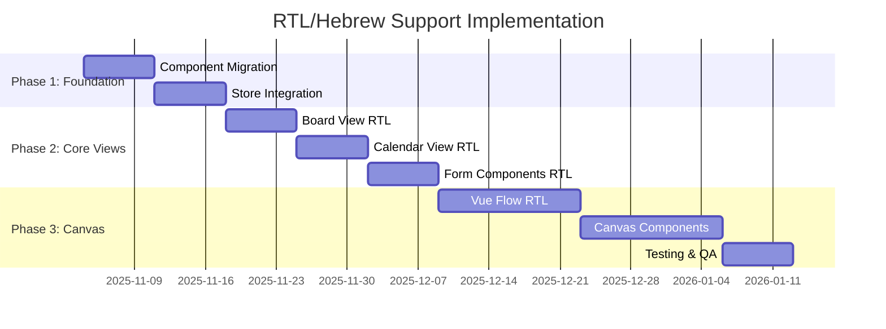

# RTL and Hebrew Language Support Implementation PRD

## Product Requirements Document

**Project**: Pomo-Flow RTL/Hebrew Support
**Version**: 1.0
**Date**: November 4, 2025
**Status**: Ready for Implementation
**Priority**: High

---

## 1. Executive Summary

### 1.1 Business Objective
Enable Pomo-Flow to fully support Hebrew (and other RTL) languages, expanding market reach to Hebrew and Arabic speaking users while maintaining the application's sophisticated user experience and functionality.

### 1.2 Current State Assessment
The application has exceptional RTL readiness (75/100) with comprehensive infrastructure already in place:
- Complete Vue i18n setup with English/Hebrew translations
- Advanced Tailwind RTL plugin with 580+ lines of RTL utilities
- Sophisticated `useDirection` composable for LTR/RTL switching
- Persistent language preferences and auto-detection
- Hebrew-optimized font support

### 1.3 Success Metrics
- **User Experience**: Seamless switching between LTR/RTL modes
- **Text Rendering**: 100% Hebrew text renders correctly with proper alignment
- **Layout Consistency**: No broken layouts or overlapping elements in RTL mode
- **Performance**: <5% performance impact with RTL mode active
- **Accessibility**: Full RTL screen reader compatibility

---

## 2. Requirements

### 2.1 Functional Requirements

#### FR-001: Language Switching
- Users must be able to switch between English and Hebrew languages
- Language preference must persist across sessions
- Application must auto-detect browser language on first visit
- Direction (LTR/RTL) must automatically change based on language selection

#### FR-002: Text Direction and Alignment
- All text content must follow RTL direction when Hebrew is selected
- Text alignment must be appropriate for RTL (right-aligned for headers, left-aligned for numbers)
- Mixed content (Hebrew/English) must handle correctly
- Input fields must accept Hebrew text with proper direction

#### FR-003: Layout Adaptation
- All UI layouts must mirror appropriately in RTL mode
- Navigation elements must reorder for RTL (left becomes right)
- Spacing and margins must adjust using logical properties
- Icons requiring mirroring must automatically flip

#### FR-004: Component RTL Support
- **Board View**: Kanban swimlanes, task cards, drag-drop zones
- **Calendar View**: Date formatting, week layouts, day columns
- **Canvas View**: Node positioning, drag calculations, Vue Flow integration
- **Forms**: Input fields, modals, multi-column layouts
- **Navigation**: Sidebar, headers, breadcrumbs, tabs

### 2.2 Non-Functional Requirements

#### NFR-001: Performance
- RTL mode must not impact application startup time (>100ms increase)
- Layout switching must complete within 200ms
- Memory usage increase must be <5% with RTL mode

#### NFR-002: Compatibility
- Support all modern browsers (Chrome, Firefox, Safari, Edge)
- Compatible with existing Vue 3, Pinia, and Tailwind setup
- Must not break existing LTR functionality

#### NFR-003: Maintainability
- RTL implementation must use existing Tailwind RTL utilities
- No duplicate CSS or component code
- Clear patterns for future RTL language additions

#### NFR-004: Accessibility
- Screen readers must properly navigate RTL content
- Keyboard navigation must work in both directions
- ARIA labels must be direction-agnostic

---

## 3. Technical Specification

### 3.1 Current Architecture Analysis

#### Existing RTL Infrastructure
```typescript
// Direction Management (src/composables/useDirection.ts)
- Auto locale detection from browser
- RTL language list: ['ar', 'he', 'fa', 'ur']
- Persistent localStorage preferences
- Reactive direction updates

// CSS RTL Utilities (tailwind.config.js)
- 580+ lines of RTL configuration
- Logical property utilities: ms-/me-, ps-/pe-, start-/end-
- Direction variants: rtl:ltr: conditional styling
- RTL-specific component classes

// Internationalization (src/locales/)
- English (en.json) and Hebrew (he.json) translations
- Vue i18n v9.14.5 fully configured
- Pluralization and date localization
```

#### Component Analysis
- **Total Components**: 45+ components need RTL review
- **Critical Components**: BoardView, CalendarView, CanvasView, TaskNode
- **Base Components**: 12 base components need systematic RTL updates

### 3.2 Implementation Architecture

#### Phase 1: Foundation (1-2 weeks)
```typescript
// 1. Component Migration Strategy
// Replace hard-coded directional properties
margin-left: var(--space-4);     → margin-inline-start: var(--space-4);
text-align: left;               → text-align: start;
float: left;                    → float: inline-start;
border-left: 1px solid;         → border-inline-start: 1px solid;

// 2. Store Enhancement
interface UIState {
  locale: 'en' | 'he';
  direction: 'ltr' | 'rtl';
  isRTL: boolean;
}

// 3. Settings Integration
const settingsItems = [
  {
    id: 'language',
    component: 'LanguageSelector',
    props: { languages: ['en', 'he'] }
  }
]
```

#### Phase 2: Core Views (2-3 weeks)
```vue
<!-- BoardView RTL Adaptation -->
<template>
  <div class="flex gap-4" :class="{ 'flex-row-reverse': isRTL }">
    <div class="flex-1" v-for="swimlane in swimlanes" :key="swimlane.id">
      <div class="text-start font-semibold" :class="{ 'text-end': isRTL }">
        {{ swimlane.title }}
      </div>
    </div>
  </div>
</template>

<!-- CalendarView RTL Adaptation -->
<template>
  <div class="calendar-grid" :dir="direction">
    <div class="calendar-header" :class="{ 'flex-row-reverse': isRTL }">
      <div v-for="day in weekDays" :key="day.id"
           class="day-cell"
           :class="{ 'text-end': isRTL }">
        {{ day.name }}
      </div>
    </div>
  </div>
</template>
```

#### Phase 3: Canvas System (3-4 weeks)
```typescript
// Canvas RTL Positioning
interface CanvasPosition {
  x: number;
  y: number;
}

// RTL-aware position calculation
const getRTLPosition = (position: CanvasPosition, canvasWidth: number): CanvasPosition => {
  return {
    x: isRTL.value ? canvasWidth - position.x : position.x,
    y: position.y
  }
}

// Vue Flow RTL Configuration
const flowConfig = {
  fitView: true,
  snapToGrid: true,
  snapGrid: [20, 20],
  defaultViewport: { x: 0, y: 0, zoom: 1 },
  rtl: isRTL.value // RTL support flag
}
```

---

## 4. Implementation Plan

### 4.1 Phase 1: Foundation Completion (Week 1-2)

#### Sprint 1.1: Component Migration
**Target**: 15 base components
- BaseButton, BaseInput, BaseModal, BaseCard
- BaseDropdown, BaseTabs, BaseSidebar
- TaskCard, ProjectCard, TimerDisplay

**Acceptance Criteria**:
- All components use logical CSS properties
- RTL utilities properly applied
- Visual validation with Hebrew text

#### Sprint 1.2: Store & Settings Integration
- Enhance UI store with RTL state management
- Add language selector to settings modal
- Implement persistent preferences
- Add RTL mode toggle in development

**Acceptance Criteria**:
- Language switching works seamlessly
- Preferences persist across sessions
- Direction changes apply immediately

### 4.2 Phase 2: Core Views RTL (Week 3-5)

#### Sprint 2.1: Board View RTL
- Kanban swimlane layout adaptation
- Task card RTL styling
- Drag-drop zone RTL positioning
- Board navigation RTL support

#### Sprint 2.2: Calendar View RTL
- Calendar grid RTL layout
- Date formatting RTL support
- Week view day ordering
- Event positioning RTL

#### Sprint 2.3: Form Components RTL
- Modal positioning RTL
- Multi-column form layouts
- Input field text direction
- Validation message positioning

### 4.3 Phase 3: Canvas System RTL (Week 6-9)

#### Sprint 3.1: Vue Flow RTL Integration
- Node positioning RTL calculations
- Edge connections RTL support
- Viewport controls RTL
- Drag calculations RTL adaptation

#### Sprint 3.2: Canvas Components RTL
- Section layouts RTL
- Task node RTL styling
- Context menu RTL positioning
- Multi-selection RTL support

#### Sprint 3.3: Icon & Asset RTL
- Navigation icon mirroring
- SVG graphic adaptation
- Lucide icon RTL variants
- Visual asset optimization

---

## 5. Testing Strategy

### 5.1 Testing Scope

#### Functional Testing
```typescript
describe('RTL Functionality', () => {
  test('language switching from English to Hebrew', async () => {
    await page.selectOption('#language-selector', 'he')
    await expect(page.locator('body')).toHaveAttribute('dir', 'rtl')
    await expect(page.locator('h1')).toContainText('עברית')
  })

  test('layout adapts to RTL mode', async () => {
    await page.goto('/?locale=he')
    const sidebar = page.locator('.sidebar')
    await expect(sidebar).toHaveCSS('right', '0px')
  })

  test('Hebrew text input works correctly', async () => {
    await page.fill('[data-testid="task-input"]', 'משימה חדשה')
    await expect(page.locator('.task-title')).toContainText('משימה חדשה')
  })
})
```

#### Visual Testing
- Cross-browser RTL validation
- Layout consistency screenshots
- Hebrew font rendering tests
- Performance impact measurement

#### Accessibility Testing
- Screen reader RTL navigation
- Keyboard navigation in RTL
- ARIA label validation
- Color contrast in RTL mode

### 5.2 Test Environment
- **Browsers**: Chrome, Firefox, Safari, Edge (latest 2 versions)
- **Devices**: Desktop, tablet, mobile viewports
- **Languages**: English (LTR), Hebrew (RTL)
- **Tools**: Playwright,axe DevTools, Lighthouse

---

## 6. Success Criteria

### 6.1 Must-Have Criteria
- [ ] Complete Hebrew language support with proper RTL layout
- [ ] Seamless language switching without page reload
- [ ] All existing functionality preserved in RTL mode
- [ ] Performance impact <5% in RTL mode
- [ ] Cross-browser RTL compatibility

### 6.2 Should-Have Criteria
- [ ] Automatic browser language detection
- [ ] Persistent language preferences
- [ ] RTL-aware drag and drop in Canvas
- [ ] Screen reader compatibility
- [ ] Mobile RTL responsiveness

### 6.3 Could-Have Criteria
- [ ] Additional RTL languages (Arabic, Farsi)
- [ ] RTL animations and transitions
- [ ] RTL-specific keyboard shortcuts
- [ ] Advanced RTL typography features

---

## 7. Risk Assessment

### 7.1 Technical Risks

#### High Risk
- **Vue Flow RTL Support**: Uncertain RTL compatibility for node positioning
- **Canvas Performance**: Complex drag calculations may impact performance
- **Third-party Libraries**: Naive UI RTL support limitations

#### Medium Risk
- **Layout Shifts**: RTL switching may cause visual layout shifts
- **Font Rendering**: Hebrew fonts may render differently across browsers
- **Icon Mirroring**: Some icons may not mirror correctly

#### Low Risk
- **CSS RTL Utilities**: Well-established Tailwind RTL plugin
- **i18n Infrastructure**: Vue i18n is production-ready
- **Component Updates**: Systematic component migration

### 7.2 Mitigation Strategies
- **Vue Flow**: Create custom RTL positioning calculations
- **Performance**: Implement lazy loading for RTL assets
- **Testing**: Comprehensive RTL test suite
- **Fallback**: Graceful degradation for unsupported features

---

## 8. Timeline & Resources

### 8.1 Project Timeline


### 8.2 Resource Allocation
- **Frontend Developer**: 1.0 FTE (8 weeks)
- **QA Engineer**: 0.5 FTE (2-3 weeks)
- **UX Designer**: 0.2 FTE (1 week for RTL validation)
- **DevOps**: Minimal (existing infrastructure supports RTL)

### 8.3 Budget Estimate
- **Development**: ~320 hours (8 weeks × 40 hours)
- **Testing**: ~40 hours
- **Design Review**: ~16 hours
- **Total**: ~376 hours

---

## 9. Dependencies

### 9.1 Technical Dependencies
- Vue 3.4.0+ ✅ (Current)
- Tailwind CSS RTL Plugin ✅ (Configured)
- Vue i18n 9.14.5+ ✅ (Installed)
- Naive UI RTL Support ❓ (Requires validation)
- Vue Flow RTL Support ❓ (Requires testing)

### 9.2 External Dependencies
- Hebrew translation completeness ✅ (Available)
- Font licensing for Hebrew ✅ (System fonts)
- Browser RTL support ✅ (Modern browsers)

---

## 10. Post-Launch Considerations

### 10.1 Monitoring
- RTL usage analytics tracking
- Performance monitoring in RTL mode
- User feedback collection for RTL
- Error tracking for RTL-specific issues

### 10.2 Future Enhancements
- Additional RTL languages (Arabic, Farsi, Urdu)
- RTL-specific user preferences
- Advanced Hebrew typography features
- RTL keyboard shortcuts customization

### 10.3 Maintenance
- Regular RTL compatibility testing
- Translation updates and maintenance
- Component RTL pattern documentation
- RTL development guidelines

---

## 11. Approval

**Product Owner**: _________________________
**Engineering Lead**: _______________________
**Design Lead**: ___________________________
**Date**: _________________________________

---

*This PRD serves as the comprehensive guide for implementing RTL and Hebrew language support in Pomo-Flow. The existing sophisticated infrastructure puts this project in an excellent position for successful implementation within the estimated timeline.*